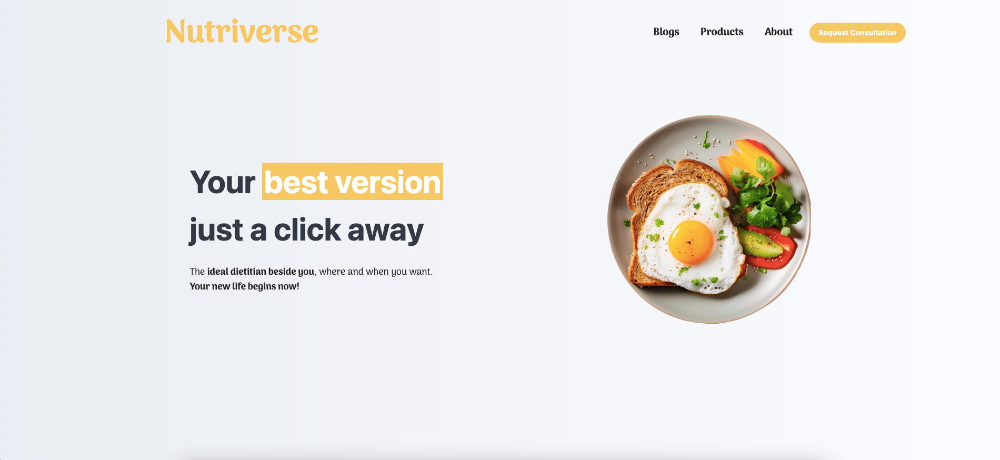

# Nutriverse 

    

## Project issued

Date Started : 14/Nov/2024

Date Presented : [Pending graduation year]

Level : Senior

## Project idea
Step into the NutriVerse, where technology meets nutrition for a healthier future. Designed for dieticians and their clients, NutriVerse leverages advanced machine learning to analyze meals and provide accurate recipes and calorie insights. Clients can effortlessly track their eating habits, while dieticians benefit from comprehensive dashboards, progress reports, and tailored recommendations. NutriVerse isn’t just a tool—it’s a universe of smarter, healthier living, built to connect and empower individuals and professionals alike

## Project 

| Attempt | #1    | #2    |
| :---:   | :---: | :---: |
| Seconds | 301   | 283   |

### Product link

https://bicandy-new.42web.io/nutriverse

---
62410031@students.liu.edu.lb | LinkedIn: [fbicandy](https://www.linkedin.com/in/freddy-bicandy/)
