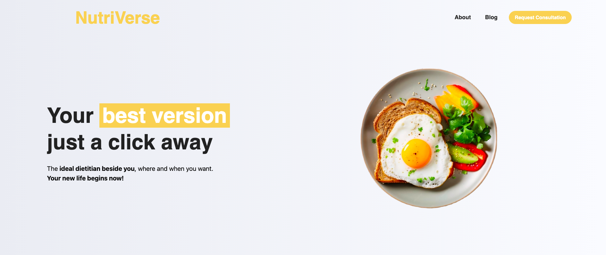

# Nutriverse 

    

## Project issued

<b>Date Started :</b> 14/Nov/2024

<b>Date Presented :</b> [Pending graduation year]

<b>Level :</b> Senior

## Project idea
Step into the NutriVerse, where technology meets nutrition for a healthier future. Designed for dieticians and their clients, NutriVerse leverages advanced machine learning to analyze meals and provide accurate recipes and calorie insights. Clients can effortlessly track their eating habits, while dieticians benefit from comprehensive dashboards, progress reports, and tailored recommendations. NutriVerse isn’t just a tool—it’s a universe of smarter, healthier living, built to connect and empower individuals and professionals alike

## Project Solutions

| **NutriBlog**  | **NutriTracker** | **NutriMS** |
|:-----------------------------------------------------:|:----------------:|:-----------:|
| NutriBlog is a blog web app embedded as one of our solutions to deliver daily tips for everyone.| In    Progress | In Progress
  NutriBlog offers users the ability to like and comment on their favorite daily tips, as well as create   and share their own blogs in an easy and unified way. Additionally, NutriBlog includes an Admin      page with elevated privileges to monitor all requested consultations and blogs, and take necessary      actions such as reviewing and deleting or accepting blogs, removing comments, reviewing users who       submitted consultation requests, and more.|               |          |

## Tech Stack
 ### Nutriblog
    

### Solution link

https://bicandy-new.42web.io/nutriverse

---
62410031@students.liu.edu.lb | LinkedIn: [fbicandy](https://www.linkedin.com/in/freddy-bicandy/)
